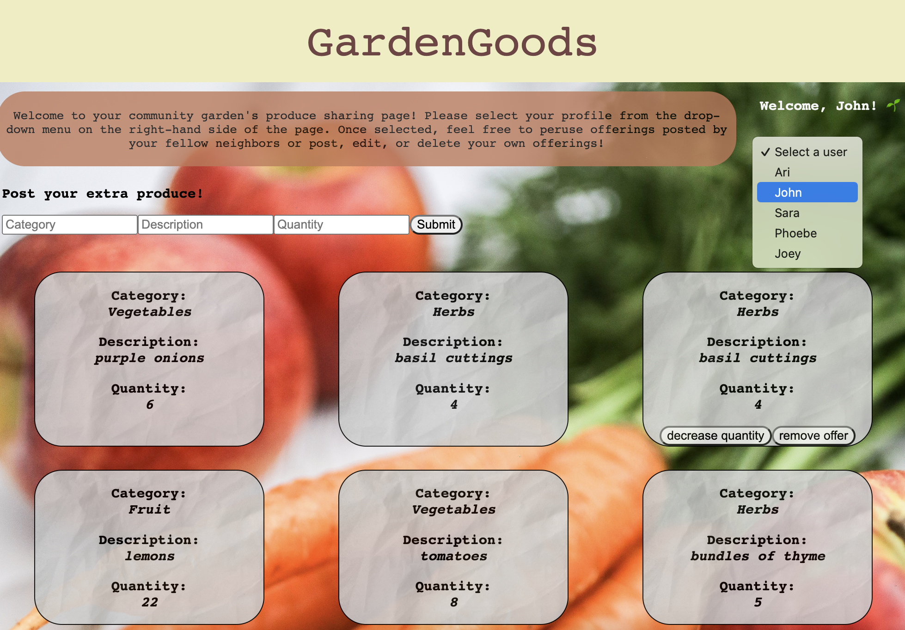

## GardenGoods Phase-3 Project Frontend

Welcome to GardenGoods! This full-stack app was built with a React frontend and a Ruby backend to practice utilizing Active Record and CRUD capabilities. It is intended to be used by small garden communities to encourage produce sharing/swapping. The user profile dropdown located in the top right of the screen is pre-seeded based on member information. Once a profile is selected, the user may fill out the form and all posts will be attributed to their profile. As shown below, John has one post that they may now decrease the quantity available as they share their produce or remove their listing as they see fit. All CRUD actions persist on the backend.

Frontend Setup:
Please run npm install and npm start to get the app up and running.

The backend file can be found on GitHub: https://github.com/Hrdlickaj/phase-3-gardengoods-project-backend.
Please run bundle install and bundle exec rake server in that file ensure a seamless setup.
